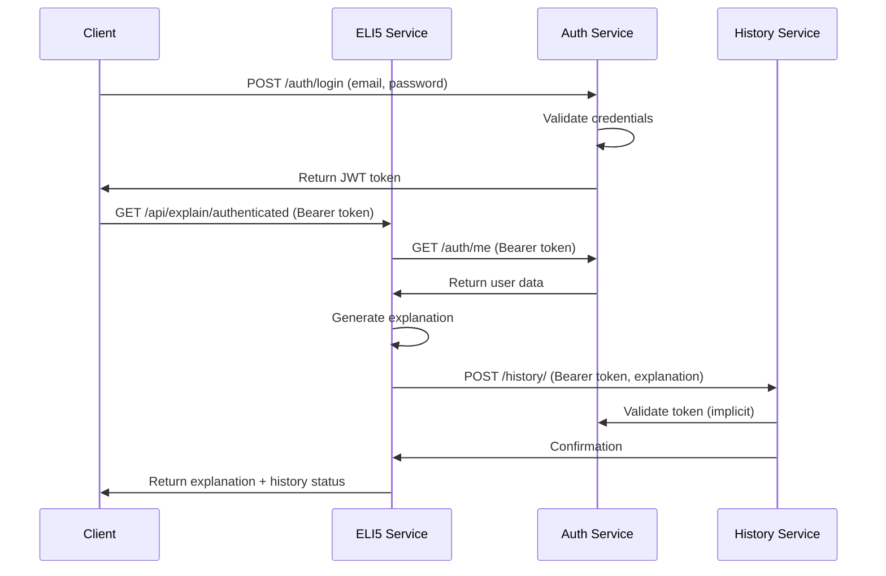

# ELI5 Microservices Architecture

This project implements a microservices architecture for the ELI5 (Explain Like I'm 5) application with the following services:

## Services Overview

### 1. **ELI5 Service** (Port 8000)

- **Purpose**: Main service that generates concept explanations using Gemini AI
- **Responsibilities**:
  - Generate AI-powered explanations of computer science concepts
  - Handle user authentication via Auth Service
  - Save explanation history via History Service
  - Serve both authenticated and public endpoints

### 2. **Auth Service** (Port 8001)

- **Purpose**: Handles user authentication and authorization
- **Responsibilities**:
  - User registration and login
  - JWT token generation and validation
  - User data management
  - Provide `/auth/me` endpoint for token validation

### 3. **History Service** (Port 8002)

- **Purpose**: Manages user explanation history
- **Responsibilities**:
  - Store user's concept explanation history
  - Retrieve user history with proper authorization
  - Maintain audit trail of user activities

### 4. **Frontend Service** (Port 3000)

- **Purpose**: Next.js frontend application
- **Responsibilities**:
  - User interface for the application
  - Communicate with all backend services
  - Handle user interactions and display data

## Microservices Communication

### HTTP Communication Pattern

All services communicate via **HTTP REST APIs** using the following patterns:

#### 1. **Service Discovery**

- Services use environment variables for endpoint configuration
- Supports both local development and containerized deployment
- Health check endpoints for service monitoring

#### 2. **Authentication Flow**



#### 3. **Service Client Architecture**

Each service has a `service_clients.py` module with:

- **BaseServiceClient**: Common HTTP functionality with retry logic
- **Specific Service Clients**: Auth, History, etc.
- **Error Handling**: Proper exception handling and logging
- **Connection Management**: Connection pooling and cleanup

### Key Communication Features

#### 1. **Retry Logic**

- Automatic retries for transient failures
- Configurable retry count and timeout
- Exponential backoff for better resilience

#### 2. **Circuit Breaker Pattern**

- Services gracefully handle downstream failures
- Fallback mechanisms when services are unavailable
- Health checks for service monitoring

#### 3. **Security**

- JWT tokens for service-to-service authentication
- Token validation through Auth Service
- Secure token passing between services

## API Endpoints

### ELI5 Service (Port 8000)

```
GET  /api/explain              # Public concept explanation
GET  /api/explain/authenticated # Authenticated concept explanation (saves to history)
POST /api/auth/signup          # User registration (proxied to Auth Service)
POST /api/auth/login           # User login (proxied to Auth Service)
GET  /api/history              # Get user history (requires auth)
```

### Auth Service (Port 8001)

```
POST /auth/signup              # User registration
POST /auth/login               # User login
GET  /auth/me                  # Token validation
GET  /auth/health              # Health check
```

### History Service (Port 8002)

```
POST /history/                 # Add history record (requires auth)
GET  /history/{user_id}        # Get user history (requires auth)
GET  /history/health           # Health check
```

## Deployment Options

### 1. **Local Development**

```bash
# Terminal 1 - Auth Service
cd auth_service
pip install -r requirements.txt
uvicorn main:app --port 8001 --reload

# Terminal 2 - History Service
cd history_service
pip install -r requirements.txt
uvicorn main:app --port 8002 --reload

# Terminal 3 - ELI5 Service
cd ELI5
pip install -r requirements.txt
uvicorn main:app --port 8000 --reload

# Terminal 4 - Frontend
cd ELI5_frontend/eli5
npm install
npm run dev
```

### 2. **Docker Compose Deployment**

```bash
# Copy environment file
cp .env.example .env
# Edit .env with your configuration

# Start all services
docker-compose up --build

# Stop all services
docker-compose down
```

### 3. **Production Deployment**

Each service can be deployed independently to:

- **Kubernetes clusters**
- **Cloud providers** (AWS ECS, Google Cloud Run, Azure Container Instances)
- **Traditional VPS** with reverse proxy (nginx)

## Configuration

### Environment Variables

| Variable              | Description              | Default                 |
| --------------------- | ------------------------ | ----------------------- |
| `AUTH_SERVICE_URL`    | Auth service endpoint    | `http://localhost:8001` |
| `HISTORY_SERVICE_URL` | History service endpoint | `http://localhost:8002` |
| `ELI5_SERVICE_URL`    | Main service endpoint    | `http://localhost:8000` |
| `SECRET_KEY`          | JWT secret key           | Required                |
| `GEMINI_API_KEY`      | Google Gemini API key    | Required                |
| `HTTP_TIMEOUT`        | HTTP request timeout     | `30.0`                  |
| `HTTP_MAX_RETRIES`    | Max retry attempts       | `3`                     |

### Service URLs for Different Environments

#### Local Development

```bash
AUTH_SERVICE_URL=http://localhost:8001
HISTORY_SERVICE_URL=http://localhost:8002
ELI5_SERVICE_URL=http://localhost:8000
```

#### Docker Compose

```bash
AUTH_SERVICE_URL=http://auth-service:8000
HISTORY_SERVICE_URL=http://history-service:8000
ELI5_SERVICE_URL=http://eli5-service:8000
```

#### Production

```bash
AUTH_SERVICE_URL=https://auth.your-domain.com
HISTORY_SERVICE_URL=https://history.your-domain.com
ELI5_SERVICE_URL=https://api.your-domain.com
```

## Error Handling

### Service Communication Errors

- **503 Service Unavailable**: When downstream service is not reachable
- **500 Internal Server Error**: For unexpected errors during communication
- **401 Unauthorized**: For invalid or expired tokens
- **Graceful Degradation**: Services continue operating with reduced functionality

### Retry Strategy

1. **Immediate retry** for transient network errors
2. **Exponential backoff** for server errors
3. **Circuit breaker** for persistent failures
4. **Fallback responses** when possible

## Security Considerations

### 1. **JWT Token Security**

- Tokens include user ID and email
- Configurable expiration time
- Secure token validation across services

### 2. **Service-to-Service Communication**

- All inter-service calls include proper authorization headers
- Token validation at service boundaries
- Secure transmission of sensitive data

### 3. **Environment Security**

- Sensitive data stored in environment variables
- Different configurations for different environments
- No hardcoded secrets in code

## Monitoring and Observability

### Health Checks

Each service provides health check endpoints:

- `/auth/health` - Auth Service
- `/history/health` - History Service
- Built-in FastAPI health monitoring

### Logging

- Structured logging with request tracing
- Service-to-service call logging
- Error tracking and alerting

### Metrics

- HTTP request/response metrics
- Service communication latency
- Error rates and patterns

This architecture provides a scalable, maintainable, and secure foundation for the ELI5 application with proper separation of concerns and robust inter-service communication.
